# C64 Emulator One-Pager Walkthrough

I have successfully created a single-file Commodore 64 simulator that runs in the browser. It features authentic visuals (CRT effect, correct colors, and font) and a functional BASIC interpreter.

## Changes
### [NEW] [c64.html](file:///c:/git/html_apps/c64.html)
- Implemented CSS-based CRT monitor frame with scanlines and curvature.
- Integrated authentic "Commodore 64 Pixelized" font.
- Built a JavaScript-based BASIC interpreter handling:
    - Text output (`PRINT`)
    - Program management (`LIST`, `RUN`, `NEW`)
    - System commands (`SYS 64738` for reset)
    - Keyboard input emulation.
- **Enhanced Features**:
    - **Flexible Parsing**: Supports commands without spaces (e.g., `SYS64738`, `PRINT"HELLO"`, `20 GOTO10`).
    - **Authentic Reset**: `SYS 64738` freezes the current screen, applies a "clipping" glitch for 2 seconds, and *then* performs the system reboot.
    - **Color Control**: `POKE 53280,x` and `POKE 53281,x` change border/background colors.
        - **Refined Palette**: Restored custom "nicer" shades for default Blue and Light Blue to match the original aesthetic.
    - **BASIC Extensions**:
        - **Escape Key**: Breaks running programs with a correctly formatted `BREAK IN LINE...` message.
        - **Semicolons**: `PRINT "Hello";` suppresses newline for continuous output.
        - **Commands**: `NEW` clears memory; `LIST` format refined (no leading spaces).
        - **Cursor Control**: `Arrow Keys` move cursor freely. `Enter` reads text from the current line for execution/editing.
        - **Authentic Cursor**: Blinking now swaps colors (Foreground <-> Background) instead of fading.
        - **Cursor Wrapping**: Cursor wraps to previous/next line when hitting left/right screen edges.

## Verification Results

### Automatic Verification
I used a browser agent to verify the core functionality:

1.  **Boot & Reset**: Confirmed clean boot and authentic reset glitch dimensions.
    *   **Glitch State**: Screen freezes with old content and clipped edges.
    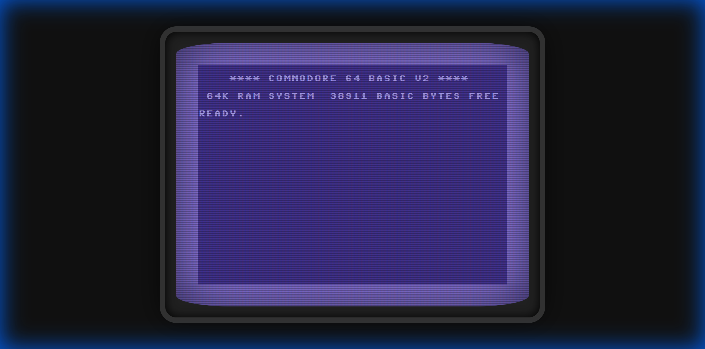
    *   **Post Reset**: Fresh boot screen appears after delay.
    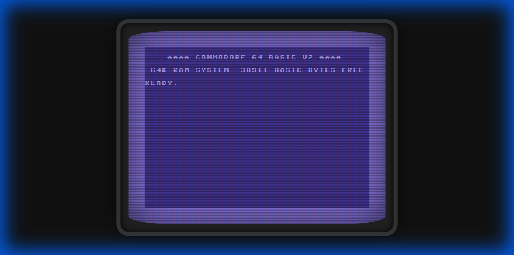

2.  **Screen Filling & Break**: Verified `10 PRINT"A";`:
    - Screen fills continuously due to semicolon.
    - `Escape` key cleanly stops execution on a NEW line.
    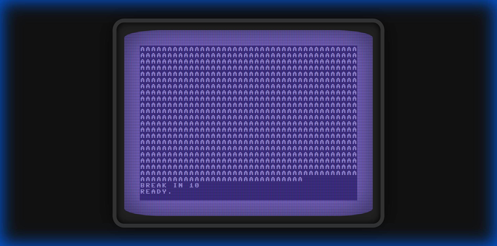

3.  **Color POKEs**: Verified `POKE 53280` (Border) and `POKE 53281` (Background).
    *   **Direct Mode**: `POKE 53280,2` (Red) and `53281,0` (Black).
    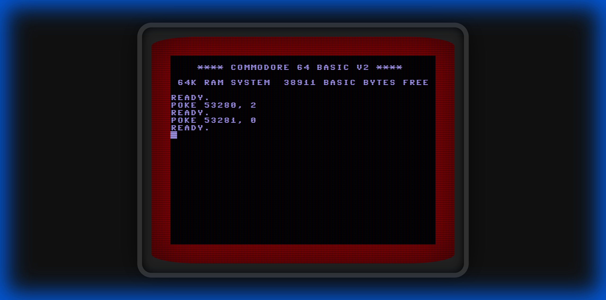
    *   **Restored Palette**: Reset restores the preferred custom Blue/Light Blue shades.
    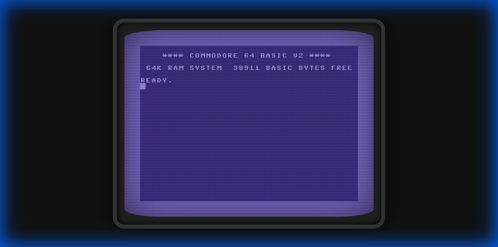

4.  **BASIC Management**: Verified `NEW` and `LIST`.
    *   **LIST Formatting**: No leading spaces.
    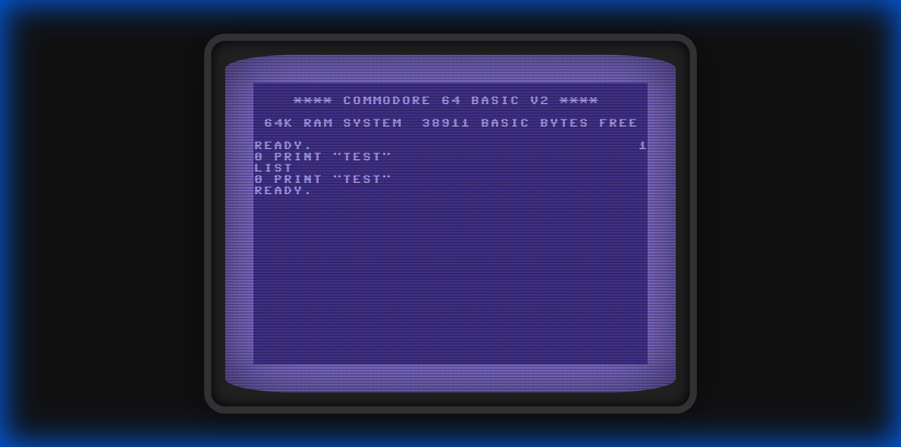
    *   **NEW Command**: Clears program from memory.
    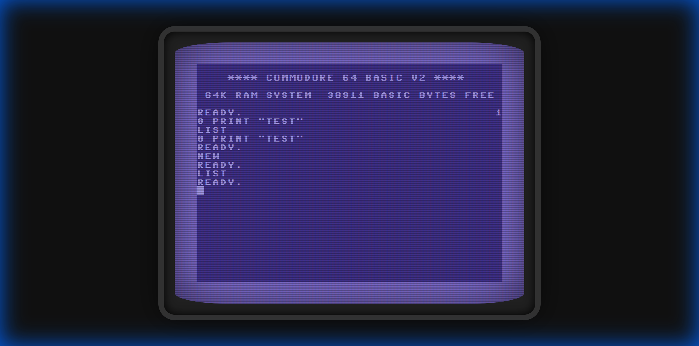

5.  **Cursor & Editing**: Verified cursor navigation and editing.
    *   **Cursor Blink**: Character 'A' remains visible (inverted colors) when cursor is "on".
    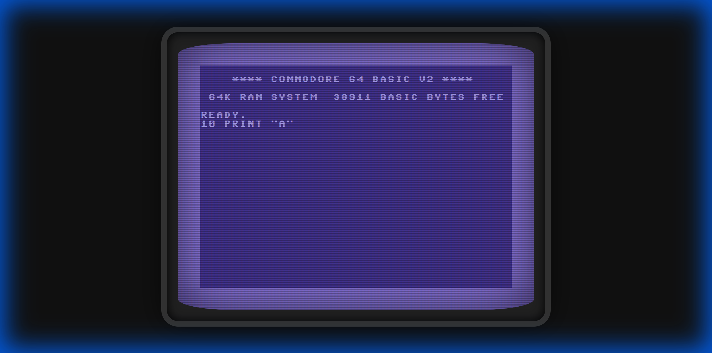
    *   **Editing**: Edited line to `10 PRINT "B"`, ran it, verified output "B".
    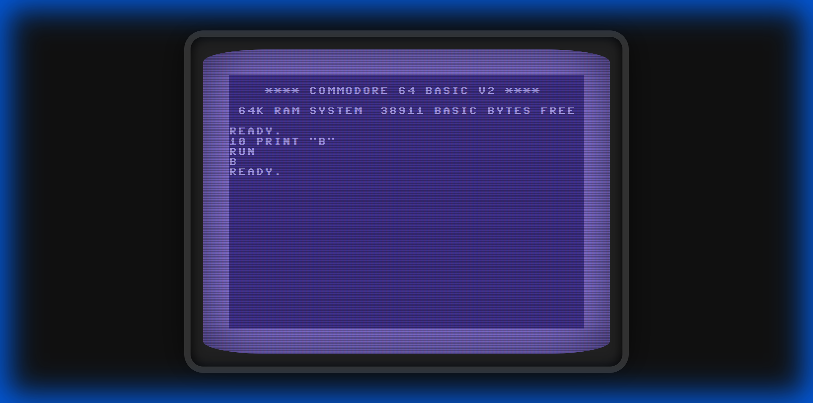

6.  **Cursor Wrapping**: Verified wrapping behavior.
    *   **Wrap Left**: Left Arrow from (0, y) wraps to (39, y-1).
    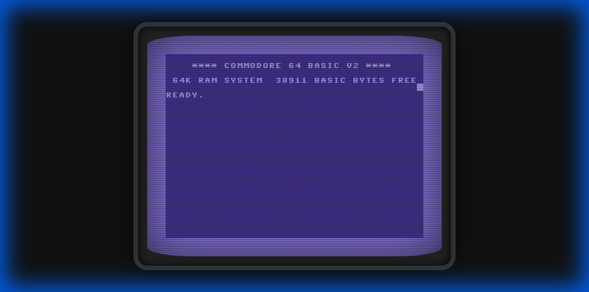
    *   **Wrap Right**: Right Arrow from (39, y) wraps to (0, y+1).
    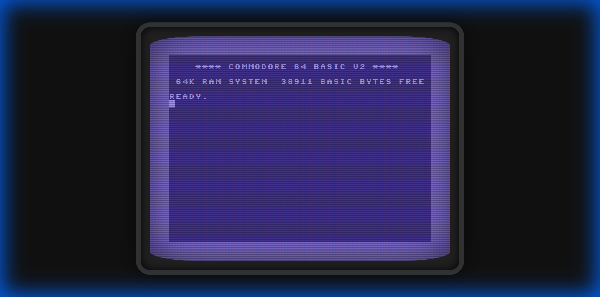

@verification_video

